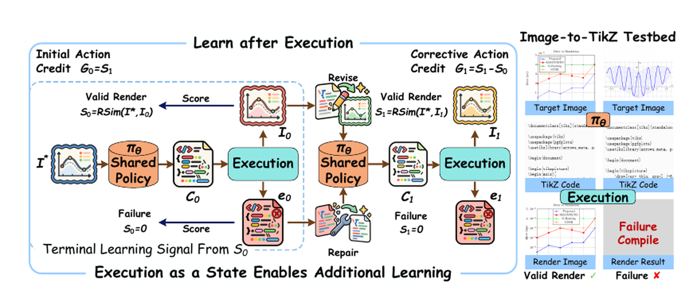
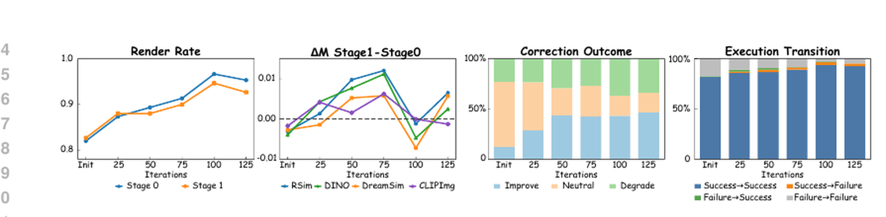

# Learning after Execution with Action-Specific Credit

Official code for **Learning after Execution with Action-Specific Credit** (ICLR 2027 submission).

Execution is usually treated as terminal feedback: a generated program is executed, scored, and the interaction ends. We instead use the execution result as an **intermediate state** for an additional action by the same policy. The policy first generates and executes an initial program, then revises a valid render or repairs a failed execution.

<p align="center">
  
</p>

The two actions share the same final objective but receive action-specific credit:

\[
G_0 = S_1, \qquad G_1 = S_1 - S_0.
\]

The initial action is credited by the final trajectory outcome, while the corrective action is credited by improvement over the executed state it inherits. In the implementation, both returns are scaled by \(\lambda=10\) and mean-centered independently within each target-image group.

## Main Results

Results on **Final-945**. Visual metrics use the fixed-zero convention, where failed executions receive zero.

| Method | Output | Render Success ↑ | RSim ↑ | DINO ↑ | DreamSim ↑ | CLIPImg ↑ |
|---|---|---:|---:|---:|---:|---:|
| Base model | Direct | 71.64% | 0.4033 | 0.6025 | 0.5545 | 0.6435 |
| Direct-SFT | Direct | 64.66% | 0.3554 | 0.5427 | 0.4960 | 0.5781 |
| Direct-GRPO | Direct | 81.90% | 0.4709 | 0.7046 | 0.6468 | 0.7410 |
| Direct-GRPO (+100) | Direct | 88.25% | 0.5135 | 0.7629 | 0.7019 | 0.7996 |
| **Ours** | **Stage 0** | **92.70%** | **0.5382** | **0.8014** | **0.7330** | **0.8372** |
| **Ours** | **Stage 1** | **92.80%** | **0.5446** | **0.8046** | **0.7401** | **0.8409** |
| **Ours** | **Selected** | **94.18%** | **0.5649** | **0.8221** | **0.7593** | **0.8583** |

The Stage 0 result is especially important: it uses the same single-call inference setting as the direct baselines, showing that learning from post-execution interaction strengthens the shared policy itself rather than merely benefiting from a second call.

## Learning Dynamics

The corrective behavior is learned during training rather than automatically inherited from a strong direct generator. On Dev-150, the fraction of paired-success examples improved by Stage 1 rises from 12.2% at initialization to 42.5% at step 75 and 46.8% at step 125.

<p align="center">
  
</p>

Correction is also state dependent: weaker executed states leave more room for improvement, while already-strong Stage 0 outputs can be harmed by unnecessary modification.

## Repository Layout

```text
Learning-after-Execution/
├── src/                              # main method implementation
│   └── i2t_workflow_grpo/            # internal package name retained for compatibility
├── scripts/
│   ├── train.py                      # main Python training entry
│   ├── train.sh                      # main 4-GPU launcher
│   ├── eval.sh                       # two-stage evaluation launcher
│   ├── evaluation/                   # evaluation workers / finalization
│   └── baselines/
│       ├── train_direct_sft.sh
│       └── train_direct_grpo.sh
├── configs/
│   ├── learning_after_execution.yaml # main method
│   ├── accelerate_zero2_4gpu.yaml
│   ├── deepspeed/zero2.json
│   └── baselines/
│       ├── direct_sft.yaml
│       └── direct_grpo.yaml
├── baselines/
│   ├── direct_sft/                   # Direct-SFT implementation
│   └── direct_grpo/                  # Direct-GRPO implementation
├── assets/
├── env.example
├── requirements.txt
└── requirements-paper.txt
```

The repository is intentionally **code-only**. Model weights and datasets are not distributed here.

## Installation

Python 3.10 is recommended. A working TeX Live installation is required because training and evaluation execute generated TikZ programs.

```bash
conda create -n learning-after-execution python=3.10 -y
conda activate learning-after-execution

# General installation
pip install -r requirements.txt

# Install the main method and both baselines without reinstalling dependencies
pip install -e . --no-deps
pip install -e baselines/direct_sft --no-deps
pip install -e baselines/direct_grpo --no-deps
```

For exact reproduction of the reported experiments, use the pinned environment instead:

```bash
pip install -r requirements-paper.txt
```

The reported runs used Python 3.10, CUDA 12.6, four NVIDIA A100-SXM4-80GB GPUs for RL training, and TeX Live 2026. See `requirements-paper.txt` for the exact Python package versions.

## External Assets

This code expects the following assets to be supplied locally:

| Asset | Environment variable |
|---|---|
| Qwen3-VL-8B-Instruct | `BASE_MODEL` |
| warm-start adapter | `INIT_ADAPTER` |
| RSim vision-only reward model | `RSIM_MODEL_PATH` |
| SFT training manifest | `TRAIN_MANIFEST` |
| RL dataset | `RL_DATASET` |
| TeX Live binary directory | `TEXLIVE_BIN` |
| experiment output directory | `OUTPUT_ROOT` |

For evaluation, additionally provide `EVAL_ADAPTER`, `EVAL_MANIFEST`, and optionally `EVAL_GT_ROOT` when manifest paths are dataset-relative.

Start from:

```bash
cp env.example env.local
# edit env.local, then
source env.local
```

## Training

The paper uses the following training sequence:

```text
Qwen3-VL-8B-Instruct
        │
        ▼
   Direct-SFT
        │
        ▼
   Direct-GRPO
        │
        ▼
Learning after Execution
```

### 1. Direct-SFT baseline / initializer

```bash
bash scripts/baselines/train_direct_sft.sh
```

The paper configuration uses 3,851 eligible image-TikZ pairs, global batch size 32, LoRA rank 256, learning rate `1e-4`, and three epochs.

### 2. Direct-GRPO baseline / warm start

Set `INIT_ADAPTER` to the Direct-SFT adapter, then run:

```bash
bash scripts/baselines/train_direct_grpo.sh
```

Direct-GRPO samples `K=8` programs per target and optimizes the RSim score of the executed output. Failed executions receive reward zero.

### 3. Learning after Execution

Set `INIT_ADAPTER` to the final Direct-GRPO adapter, then run:

```bash
bash scripts/train.sh
```

The paper-active configuration uses:

- `K = 8` independent complete two-stage trajectories per target image;
- Stage 0 return: `10 * S1`;
- Stage 1 return: `10 * (S1 - S0)`;
- separate per-group mean centering for the two stages, with no standard-deviation normalization;
- stage weights `0.5 / 0.5`;
- `beta = 0`;
- GRPO clip range `0.20 / 0.28`;
- temperature `1.0`, top-p `0.9`, maximum `8192` completion tokens per action;
- execution-conditioned routing: valid Stage 0 renders are revised, failed executions are repaired;
- TeX execution with `pdflatex`, `lualatex`, and `xelatex`, shell escape disabled, 30-second timeout.

All Stage 0 and Stage 1 trajectories for an iteration are collected before optimization begins. The source code preserves the exact submitted optimization semantics, including the sequential action-microbatch updates used by the formal run.

## Evaluation

The evaluation code is included, but evaluation data are not distributed with the repository. Provide your own manifest and target-image root:

```bash
export EVAL_ADAPTER=/path/to/checkpoint
export EVAL_MANIFEST=/path/to/eval_manifest.jsonl
export EVAL_GT_ROOT=/path/to/dataset_root   # omit when manifest paths are absolute

bash scripts/eval.sh
```

The reported inference protocol uses temperature `1.0`, top-p `0.9`, repetition penalty `1.0`, and at most `8192` newly generated tokens, terminating at the first complete `\\end{document}`.

For correction-enabled inference, Stage 0 is generated from the target image. Stage 1 then receives either the rendered Stage 0 state for visual revision or a compact failure state for repair. The optional `Selected` output chooses only between the already-generated Stage 0 and Stage 1 programs: retain the sole successful render, otherwise select the higher-RSim render, breaking ties in favor of Stage 0.

### Evaluation manifest

Each JSONL row should identify a sample and point to its target image. The evaluator accepts the field names used by the paper pipeline, including:

```json
{"sample_id": "example-001", "image_path": "images/example-001.png", "gt_tikz_path": "tikz/example-001.tex"}
```

`gt_tikz_path` is optional for image-based evaluation. Relative paths are resolved under `EVAL_GT_ROOT`.

## Implementation Notes

The main implementation is under `src/`. The internal Python package name is retained from the submitted code so that imports and the experimental implementation remain unchanged; the public method name throughout this repository is **Learning after Execution**.

The core action-specific credit implementation is in:

```text
src/i2t_workflow_grpo/workflow.py
```

and the factorized credit variants used for the paper's controlled ablations are provided in:

```text
src/i2t_workflow_grpo/credit_variants.py
```

The Direct-SFT and Direct-GRPO codebases are kept under `baselines/` to make the repository hierarchy match the paper: the root implementation is the proposed method, while SFT and single-stage GRPO are supporting initialization/baseline stages.
