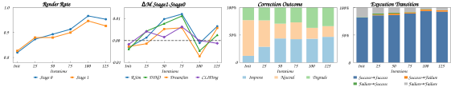

# Learning after Execution with Action-Specific Credit

Official code for **Learning after Execution with Action-Specific Credit**.

<p align="left">
  
</p>

Execution is usually treated as terminal feedback: a generated program is executed, scored, and the interaction ends. We instead use the execution result as an **intermediate state** for an additional action by the same shared policy. The policy first generates and executes an initial program, then revises a valid render or repairs a failed execution.

<p align="center">
  
</p>

The two actions receive action-specific credit:

$$
G_0 = S_1, \qquad G_1 = S_1 - S_0
$$

The initial action is credited by the final trajectory outcome, while the corrective action is credited by improvement over the executed state it inherits. In the paper setting, both returns are scaled by $\lambda=10$ and mean-centered independently within each target-image group.

## Main Results

Results on **Final-945**. Visual metrics use the fixed-zero convention, where failed executions receive zero.

| Method | Output | Render Success ↑ | RSim ↑ | DINO ↑ | DreamSim ↑ | CLIPImg ↑ |
|---|---|---:|---:|---:|---:|---:|
| Base model | Direct | 71.64% | 0.4033 | 0.6025 | 0.5545 | 0.6435 |
| Direct-SFT | Direct | 64.66% | 0.3554 | 0.5427 | 0.4960 | 0.5781 |
| Direct-GRPO | Direct | 81.90% | 0.4709 | 0.7046 | 0.6468 | 0.7410 |
| Direct-GRPO (+100) | Direct | 88.25% | 0.5135 | 0.7629 | 0.7019 | 0.7996 |
| **Ours** | **Stage 0** | **92.70%** | **0.5382** | **0.8014** | **0.7330** | **0.8372** |
| **Ours** | **Stage 1** | **92.80%** | **0.5446** | **0.8046** | **0.7401** | **0.8409** |
| **Ours** | **Selected** | **94.18%** | **0.5649** | **0.8221** | **0.7593** | **0.8583** |

The Stage 0 result uses the same single-call inference setting as the direct baselines. The gain therefore reflects a stronger shared policy rather than only the availability of an additional model call.

## Learning Dynamics

The corrective behavior is learned during training rather than automatically inherited from a strong direct generator. On Dev-150, the fraction of paired-success examples improved by Stage 1 rises from 12.2% at initialization to 42.5% at step 75 and 46.8% at step 125.

<p align="center">
  
</p>

## Repository Layout

This release intentionally keeps the **algorithmic skeleton** and removes experiment-specific orchestration such as distributed evaluation workers, Final-945 batching, audit utilities, and dataset-building helpers.

```text
Learning-after-Execution/
├── train.py                     # proposed-method training entrypoint
├── train.sh                     # proposed-method launcher
├── src/                         # proposed method
│   ├── trainer.py
│   ├── rollout.py
│   ├── workflow.py              # action-specific returns / advantages
│   ├── loss.py
│   ├── generation.py
│   ├── renderer.py
│   ├── prompt_contract.py
│   ├── metrics.py               # RSim / DINO / DreamSim / CLIPImg definitions
│   ├── rewards/rsim.py          # RSim reward used during RL
│   └── ...
├── direct_sft/                  # Direct-SFT code and launcher
│   ├── train.py
│   ├── train_direct_sft.sh
│   └── ...
├── direct_grpo/                 # Direct-GRPO code and launcher
│   ├── train_grpo.py
│   ├── train_direct_grpo.sh
│   ├── rewards/rsim.py
│   └── ...
├── configs/
│   ├── direct_sft.yaml
│   ├── direct_grpo.yaml
│   ├── learning_after_execution.yaml
│   ├── accelerate_zero2_4gpu.yaml
│   └── deepspeed/zero2.json
├── assets/
├── env.example
├── requirements.txt
└── requirements-paper.txt
```

The repository is **code-only**. Model weights and datasets are not distributed here.

## Installation

Python 3.10 is recommended. A working TeX Live installation is required because RL training executes generated TikZ programs.

```bash
conda create -n learning-after-execution python=3.10 -y
conda activate learning-after-execution
pip install -r requirements.txt
```

For the package versions used by the reported experiments:

```bash
pip install -r requirements-paper.txt
```

The reported RL runs used four NVIDIA A100-SXM4-80GB GPUs and TeX Live 2026.

## Paths

Copy the example environment file and edit local paths:

```bash
cp env.example env.local
source env.local
```

The training launchers use:

| Variable | Purpose |
|---|---|
| `BASE_MODEL` | Qwen3-VL-8B-Instruct |
| `INIT_ADAPTER` | initialization adapter for the current RL stage |
| `RSIM_MODEL_PATH` | RSim vision-only reward model |
| `TRAIN_MANIFEST` | Direct-SFT training manifest |
| `RL_DATASET` | RL dataset |
| `TEXLIVE_BIN` | TeX Live binary directory |
| `OUTPUT_ROOT` | training outputs |

## Training

The paper follows the training sequence:

```text
Qwen3-VL-8B-Instruct
        │
        ▼
   Direct-SFT
        │
        ▼
   Direct-GRPO
        │
        ▼
Learning after Execution
```

### 1. Direct-SFT

```bash
bash direct_sft/train_direct_sft.sh
```

The paper configuration uses 3,851 eligible image-TikZ pairs, global batch size 32, LoRA rank 256, learning rate `1e-4`, and three epochs.

### 2. Direct-GRPO

Set `INIT_ADAPTER` to the Direct-SFT adapter and run:

```bash
bash direct_grpo/train_direct_grpo.sh
```

Direct-GRPO samples `K=8` programs per target and optimizes the RSim score of the executed output. Failed executions receive reward zero.

### 3. Learning after Execution

Set `INIT_ADAPTER` to the final Direct-GRPO adapter and run:

```bash
bash train.sh
```

The paper-active configuration uses:

- `K = 8` independent complete two-stage trajectories per target image;
- Stage 0 credit from the final score, $G_0 = S_1$;
- Stage 1 credit from improvement, $G_1 = S_1 - S_0$;
- credit scale `10` and separate group-mean centering;
- stage weights `0.5 / 0.5`;
- `beta = 0` and GRPO clip range `0.20 / 0.28`;
- temperature `1.0`, top-p `0.9`, and maximum `8192` completion tokens per action;
- execution-conditioned routing: successful Stage 0 renders are revised, failed executions are repaired.

All Stage 0 and Stage 1 trajectories for an iteration are collected before optimization begins. The training source retains the original implementation; this public release only simplifies the repository structure around it.

## Metrics

The public repository keeps the metric definitions used in the paper, but omits the experiment-specific distributed evaluation pipeline.

`src/metrics.py` contains the image-image implementations for:

- **DINO**: DINO ViT-S/16 CLS-token cosine similarity;
- **CLIPImg**: SigLIP image-image cosine similarity;
- **DreamSim**: `1 - distance` with the paper preprocessing convention;
- **RSim**: DeTikZify `ImageSim` with EMD mode.

The RSim implementation used as the RL reward is in `src/rewards/rsim.py`. The vision-only RSim reward paths used by Learning after Execution and Direct-GRPO load the released SigLIP vision checkpoint directly and do not require the full DeTikZify Python package. The evaluation-only RSim backend in `src/metrics.py` follows DeTikZify `ImageSim` and therefore requires the upstream DeTikZify Python package. Render success is determined by the TikZ execution path in `src/renderer.py`; failed executions receive score zero under the fixed-zero convention used by the main tables.

A minimal metric call is:

```python
from src.metrics import MetricSuite

metrics = MetricSuite(
    dino_model_path="/path/to/dino-vits16",
    siglip_model_path="/path/to/siglip",
    dreamsim_cache_dir="/path/to/dreamsim_cache",
    device="cuda:0",
    enabled=("dino", "dreamsim", "clipimg"),
)

scores = metrics.compare("target.png", "prediction.png")
print(scores)
```

## Core Implementation

The main algorithm is intentionally easy to locate:

- `src/workflow.py`: stage returns and group-relative advantages;
- `src/rollout.py`: two-stage trajectory construction;
- `src/prompt_contract.py`: direct / revision / repair contexts;
- `src/loss.py`: clipped token-level GRPO objective;
- `src/trainer.py`: optimization loop;
- `src/renderer.py` and `src/rewards/rsim.py`: execution and reward.

Function names, classes, and the training logic are retained from the original implementation. Only repository paths and launch wrappers are adapted to the simplified public layout.

## Citation

An arXiv link and identifier will be added after the paper is publicly available.

```bibtex
@article{learning_after_execution,
  title   = {Learning after Execution with Action-Specific Credit},
  author  = {<AUTHOR_LIST>},
  journal = {arXiv preprint arXiv:<ARXIV_ID>},
  year    = {2027}
}
```
